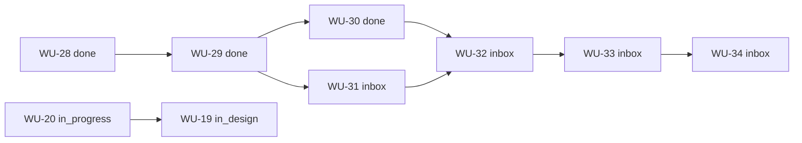

# Work Program Sequence

> Cold start: read **Do next**, then **Frontier tasks**.  
> Rules and sync ritual: [`README.md`](README.md).

| Field                 | Value                                                   |
| --------------------- | ------------------------------------------------------- |
| Board                 | `Greek Essence`                                         |
| Last refreshed (UTC)  | 2026-08-06                                              |
| Drift                 | **dirty** — see [Drift and hygiene](#drift-and-hygiene) |
| Trello source         | `jz-trello-flow list --board "Greek Essence"`           |
| Active WUs (non-Done) | 11                                                      |
| Done WUs on board     | 4                                                       |

---

## Do next (operator-facing)

If you remember nothing, do this in order:

1. **Planning hygiene (short)**  
   Clear stale Done blockers on WU-31 / WU-32, and decide whether WU-20 can close now that tracer WU-27 is Done.  
   These are Trello fact repairs; they make the map honest.

2. **Product frontier (preferred engineering/design pull)**  
   **[WU-41](https://trello.com/c/31Gc85MP) — Spike: custom consultation scheduling engine** (Inbox, high, unblocked).  
   Unblocks consultation-scheduling grilling continuation.

3. **Keep visible, do not idle the whole program on it**  
   **[WU-42](https://trello.com/c/f73YL73G) — GIORGOS ACTION: privacy-notice facts and reviewer** (Inbox, high, agency-owned).  
   Nudge / wait; continue independent work meanwhile.

4. **Next reporter engineering slice**  
   **[WU-31](https://trello.com/c/Z0XuaRNv) — Vercel production deployment resolver** (Inbox, high).  
   Hard chain continues 31 → 32 → 33 → 34 after hygiene.

5. **Optional short DX slot**  
   **[WU-38](https://trello.com/c/ssU9Rb3K) — Exempt deletion-only pushes from pre-push gates** (Ready, normal).

6. **Do not pull yet**  
   **[WU-16](https://trello.com/c/zHGjUV7a) — Drizzle ORM Setup** is Ready/high on Trello but **parked** here until a real implementation need exists post-grilling posture.

---

## Frontier tasks

Frontier = deserves attention now: unblocked (or external-wait), not parked, not stuck behind incomplete design unless design is the work.

| WU                                     | Status      | Priority | Why frontier                                                                                 | Action type                               |
| -------------------------------------- | ----------- | -------- | -------------------------------------------------------------------------------------------- | ----------------------------------------- |
| [WU-41](https://trello.com/c/31Gc85MP) | inbox       | high     | No hard blockers; unblocks consultation grilling                                             | Select → design/claim when authorized     |
| [WU-42](https://trello.com/c/f73YL73G) | inbox       | high     | Agency facts gate privacy notice readiness                                                   | Nudge Giorgos / wait                      |
| [WU-31](https://trello.com/c/Z0XuaRNv) | inbox       | high     | Next reporter build after Done foundation; listed blocker WU-29 is already Done (stale edge) | Hygiene then design/claim                 |
| [WU-38](https://trello.com/c/ssU9Rb3K) | ready       | normal   | Contract Ready, no blockers                                                                  | Optional claim                            |
| [WU-20](https://trello.com/c/IC2bdbjQ) | in_progress | high     | Still open while tracer WU-27 is Done — likely closeout/reconcile                            | Re-read and close or record remaining gap |
| [WU-37](https://trello.com/c/0VwH0IWA) | in_design   | normal   | Design in flight; not implementation-ready until Ready                                       | Continue design only                      |
| [WU-19](https://trello.com/c/iVAJ4wJU) | in_design   | normal   | Child of WU-20; design/research                                                              | Continue only if still wanted             |

Not frontier (blocked or parked):

| WU                                     | Status | Reason                                       |
| -------------------------------------- | ------ | -------------------------------------------- |
| [WU-32](https://trello.com/c/mskHnJmx) | inbox  | Hard-blocked on WU-31 (and stale Done WU-30) |
| [WU-33](https://trello.com/c/RzccalMq) | inbox  | Hard-blocked on WU-32                        |
| [WU-34](https://trello.com/c/tzT1hW1I) | inbox  | Hard-blocked on WU-33                        |
| [WU-16](https://trello.com/c/zHGjUV7a) | ready  | **Parked in B** despite Ready/high on Trello |

---

## Operator annotations

### Soft pull order

Prefer this order when choosing work (not authorization by itself):

1. Trello hygiene: stale `blocked_by` on WU-31/WU-32; WU-20 disposition
2. WU-41 consultation scheduling spike
3. WU-31 Vercel production resolver (reporter chain head)
4. WU-38 deletion-only pre-push exempt (if a small DX slot helps)
5. WU-37 Telegram PO/Secretary bot — only after design questions close → Ready
6. WU-19 Analytics — only if still a desired tracer/research outcome
7. Then reporter tail as unblocked: WU-32 → WU-33 → WU-34

Parallel, non-serial tracks: do **not** force “finish all reporter work before any product spike,” or the reverse, unless a real hard dependency appears on Trello.

### Parking lot (Ready or attractive, but do not pull)

| WU                                                         | Trello status | Parking reason                                                                                                                   |
| ---------------------------------------------------------- | ------------- | -------------------------------------------------------------------------------------------------------------------------------- |
| [WU-16](https://trello.com/c/zHGjUV7a) Drizzle ORM - Setup | ready / high  | Strategically early vs current grilling-first posture; claim only when an accepted implementation slice truly needs Neon/Drizzle |

### External waits

| WU                                     | Waiting on                        | Notes                                                                                         |
| -------------------------------------- | --------------------------------- | --------------------------------------------------------------------------------------------- |
| [WU-42](https://trello.com/c/f73YL73G) | Giorgos / agency facts + reviewer | Keep visible; do not invent privacy legal identity; continue independent foundations/grilling |

### Track goals (why these clusters exist)

| Track                     | Goal                                                 | Active members                                        |
| ------------------------- | ---------------------------------------------------- | ----------------------------------------------------- |
| Delivery workflow proof   | Prove Trello ↔ GitHub Flow end to end                | WU-20 (closeout?), WU-19 (optional child), WU-27 Done |
| Hermes weekly reporter    | Evidence-based weekly stakeholder report             | WU-31…34 active; WU-28…30 Done                        |
| Product / launch blockers | Unblock consultation grilling + privacy launch facts | WU-41, WU-42                                          |
| Developer experience      | Small workflow quality wins                          | WU-38; WU-27 Done                                     |
| Platform data (parked)    | ORM/DB foundation when product timing says so        | WU-16 parked                                          |
| Ops bots                  | Stakeholder Telegram PO/Secretary                    | WU-37 in design                                       |

---

## Derived from Trello

Rebuild everything under this heading on refresh. Do not hand-edit as authority.

### Status summary

| Status      | Count | Work Units                               |
| ----------- | ----- | ---------------------------------------- |
| inbox       | 6     | WU-31, WU-32, WU-33, WU-34, WU-41, WU-42 |
| in_design   | 2     | WU-19, WU-37                             |
| ready       | 2     | WU-16, WU-38                             |
| in_progress | 1     | WU-20                                    |
| blocked     | 0     | —                                        |
| review      | 0     | —                                        |
| done        | 4     | WU-27, WU-28, WU-29, WU-30               |

### Active Work Unit index

| ID    | Status      | Pri    | Blocked by   | Parent | Labels                                              | Title                                                            | URL                           |
| ----- | ----------- | ------ | ------------ | ------ | --------------------------------------------------- | ---------------------------------------------------------------- | ----------------------------- |
| WU-16 | ready       | high   | —            | —      | database, drizzle, neon                             | Drizzle ORM - Setup                                              | https://trello.com/c/zHGjUV7a |
| WU-19 | in_design   | normal | —            | WU-20  | analytics, research, github-flow, tracer-bullet     | Analytics - Setup                                                | https://trello.com/c/iVAJ4wJU |
| WU-20 | in_progress | high   | —            | —      | trello, github-flow, agent-workflow                 | Trello Workflow & CLI                                            | https://trello.com/c/IC2bdbjQ |
| WU-31 | inbox       | high   | WU-29        | —      | hermes-weekly-reporter, ai-arsenal, automation      | Build the Vercel production deployment resolver                  | https://trello.com/c/Z0XuaRNv |
| WU-32 | inbox       | high   | WU-30, WU-31 | —      | hermes-weekly-reporter, automation                  | Build the Hermes weekly reporting skill                          | https://trello.com/c/mskHnJmx |
| WU-33 | inbox       | normal | WU-32        | —      | hermes-weekly-reporter, automation                  | Configure the dedicated Hermes reporter and weekly cron          | https://trello.com/c/RzccalMq |
| WU-34 | inbox       | high   | WU-33        | —      | hermes-weekly-reporter, automation                  | Verify the weekly reporter end to end                            | https://trello.com/c/tzT1hW1I |
| WU-37 | in_design   | normal | —            | —      | greek-essence, hermes, telegram, product-operations | Create stakeholder-facing Telegram Product Owner/Secretary bot   | https://trello.com/c/0VwH0IWA |
| WU-38 | ready       | normal | —            | —      | git, workflow, developer-experience                 | Exempt deletion-only pushes from pre-push quality gates          | https://trello.com/c/ssU9Rb3K |
| WU-41 | inbox       | high   | —            | —      | consultation-scheduling, spike                      | Spike: custom consultation scheduling engine                     | https://trello.com/c/31Gc85MP |
| WU-42 | inbox       | high   | —            | —      | launch-readiness, privacy, giorgos-action           | GIORGOS ACTION: confirm public privacy-notice facts and reviewer | https://trello.com/c/f73YL73G |

### Hard DAG (`blocked_by`)

```text
Weekly reporter
  WU-28 (done) → WU-29 (done) → WU-30 (done)
                      ↘
                       WU-31 (inbox) → WU-32 (inbox) → WU-33 (inbox) → WU-34 (inbox)
  WU-30 (done) also listed on WU-32 (stale edge)

Parent
  WU-20 (in_progress) parent_of WU-19 (in_design)

No hard edges
  WU-16, WU-37, WU-38, WU-41, WU-42
```

Mermaid (hard edges only):



### Completed spine (recent Done)

| ID    | Title                                                     | URL                           |
| ----- | --------------------------------------------------------- | ----------------------------- |
| WU-27 | Configure Vercel - manual Re-deploy                       | https://trello.com/c/16L5cZe0 |
| WU-28 | Define the weekly progress report contract                | https://trello.com/c/gUOuzDgZ |
| WU-29 | Establish the split reporter and reusable CLI foundations | https://trello.com/c/mi1gF9Zv |
| WU-30 | Build the Git evidence collector                          | https://trello.com/c/SZN7YFkE |

---

## Drift and hygiene

Detected against the 2026-08-06 Trello read:

1. **Stale hard edge:** WU-31 still `blocked_by: [WU-29]` but WU-29 is Done.
2. **Stale hard edge:** WU-32 still lists WU-30 (Done); real remaining blocker is WU-31.
3. **Likely lifecycle drift:** WU-20 remains In Progress while tracer WU-27 is Done — re-read acceptance and close or record the real remaining gap.
4. **Selection hazard:** WU-16 is Ready + high on Trello but parked in B — agents must not auto-pull it from Ready alone.

Until those Trello repairs land, keep `drift: dirty`.

---

## Refresh checklist

When updating this file after time away:

- [ ] `jz-trello-flow list --board "Greek Essence" --output json`
- [ ] Replace **Derived from Trello** tables and DAG
- [ ] Recompute **Frontier tasks**
- [ ] Adjust **Do next** only if operator intent changed or frontier reality changed
- [ ] Preserve parking/external-wait intent unless operator changes it
- [ ] Remove soft-order entries for WUs that are Done or gone
- [ ] Set `Last refreshed` and `Drift`
- [ ] Remember: completion still happens on Trello + repo evidence, not by checking boxes here alone
