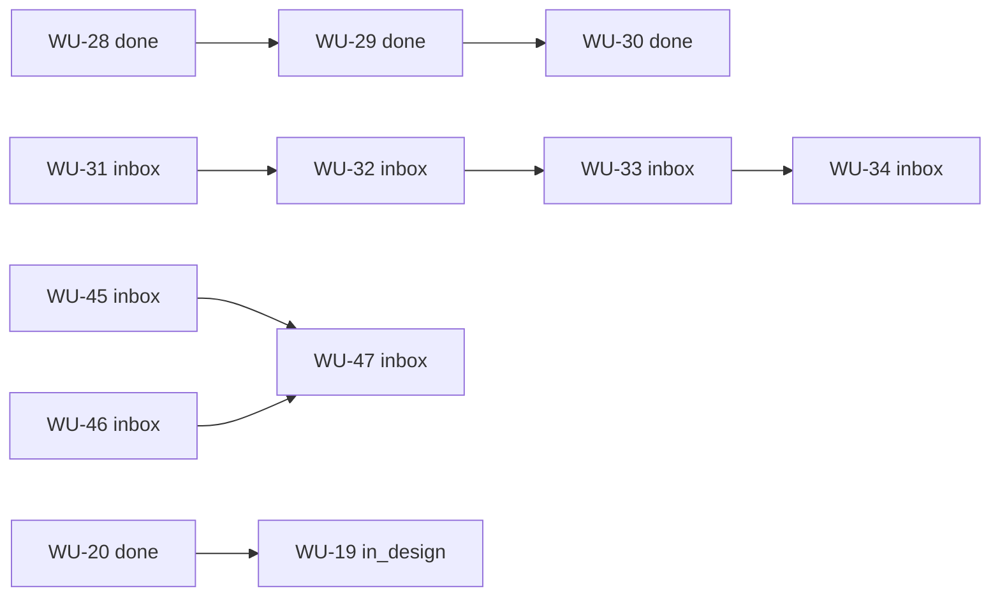

# Work Program Sequence

> Cold start: read **Do next**, then **Frontier tasks**.  
> Rules and sync ritual: [`README.md`](README.md).

| Field                 | Value                                         |
| --------------------- | --------------------------------------------- |
| Board                 | `Greek Essence`                               |
| Last refreshed (UTC)  | 2026-08-06                                    |
| Drift                 | **clean**                                     |
| Trello source         | `jz-trello-flow list --board "Greek Essence"` |
| Active WUs (non-Done) | 14                                            |
| Done WUs on board     | 5                                             |

---

## Do next (operator-facing)

If you remember nothing, do this in order:

1. **Resume active claimed work**  
   **[WU-44](https://trello.com/c/mz7FD4rm) — Plan docs management and Next.js architecture (grilling-locked)** (`in_progress`, owner `hermes-greek-essence`, parent WU-43).  
   Draft PR: https://github.com/michi-guns/greek-essence/pull/62  
   Plan: `docs/working/DOCS_AND_NEXTJS_ARCHITECTURE_PLAN.md`  
   Next: operator accept/correct/reject the plan → finish Review/Done after merge.

2. **After WU-44 lands (platform bootstrap soft order)**  
   **[WU-45](https://trello.com/c/I48iVBky) — Connect Neon and Drizzle** then **[WU-46](https://trello.com/c/CS6tdUGg) — Connect Sanity CMS**, then **[WU-47](https://trello.com/c/ELLseJP9)** (hard-blocked on 45+46).  
   Parent wrapper: **[WU-43](https://trello.com/c/bk57rL7w) — Bootstrap Public Preview platform foundations** (do not implement on the parent).

3. **Keep visible, do not idle the whole program on it**  
   **[WU-42](https://trello.com/c/f73YL73G) — GIORGOS ACTION: privacy-notice facts and reviewer** (Inbox, high, agency-owned).  
   Nudge / wait; continue independent work meanwhile.

4. **Parallel product frontier (if not on platform track)**  
   **[WU-41](https://trello.com/c/31Gc85MP) — Spike: custom consultation scheduling engine** (Inbox, high, unblocked).

5. **Next reporter engineering slice**  
   **[WU-31](https://trello.com/c/Z0XuaRNv) — Vercel production deployment resolver** (Inbox, high, unblocked).  
   Hard chain continues 31 → 32 → 33 → 34.

6. **Optional short DX slot**  
   **[WU-38](https://trello.com/c/ssU9Rb3K) — Exempt deletion-only pushes from pre-push quality gates** (Ready, normal).

---

## Frontier tasks

Frontier = deserves attention now: unblocked (or external-wait), not parked, not stuck behind incomplete design unless design is the work.

| WU                                     | Status      | Priority | Why frontier                                           | Action type                       |
| -------------------------------------- | ----------- | -------- | ------------------------------------------------------ | --------------------------------- |
| [WU-44](https://trello.com/c/mz7FD4rm) | in_progress | high     | Claimed; plan PR open; operator acceptance gate        | Resume → accept plan → close out  |
| [WU-43](https://trello.com/c/bk57rL7w) | inbox       | high     | Parent of platform bootstrap; keep visible             | Coordinate only; no direct impl   |
| [WU-45](https://trello.com/c/I48iVBky) | inbox       | high     | Next platform connect after WU-44 plan                 | Design/claim when authorized      |
| [WU-46](https://trello.com/c/CS6tdUGg) | inbox       | high     | Sanity connect; parallel-capable with WU-45 after plan | Design/claim when authorized      |
| [WU-42](https://trello.com/c/f73YL73G) | inbox       | high     | Agency facts gate privacy notice readiness             | Nudge Giorgos / wait              |
| [WU-41](https://trello.com/c/31Gc85MP) | inbox       | high     | No hard blockers; unblocks consultation grilling       | Select when not on platform track |
| [WU-31](https://trello.com/c/Z0XuaRNv) | inbox       | high     | Next reporter build; hard blockers cleared             | Design/claim when authorized      |
| [WU-38](https://trello.com/c/ssU9Rb3K) | ready       | normal   | Contract Ready, no blockers                            | Optional claim                    |
| [WU-37](https://trello.com/c/0VwH0IWA) | in_design   | normal   | Design in flight; not implementation-ready             | Continue design only              |
| [WU-19](https://trello.com/c/iVAJ4wJU) | in_design   | normal   | Child of Done WU-20; design/research                   | Continue only if still wanted     |

Not frontier (blocked or wait-for-siblings):

| WU                                     | Status | Reason                          |
| -------------------------------------- | ------ | ------------------------------- |
| [WU-47](https://trello.com/c/ELLseJP9) | inbox  | Hard-blocked on WU-45 and WU-46 |
| [WU-32](https://trello.com/c/mskHnJmx) | inbox  | Hard-blocked on WU-31           |
| [WU-33](https://trello.com/c/RzccalMq) | inbox  | Hard-blocked on WU-32           |
| [WU-34](https://trello.com/c/tzT1hW1I) | inbox  | Hard-blocked on WU-33           |

---

## Operator annotations

### Soft pull order

Prefer this order when choosing work (not authorization by itself):

1. WU-44 plan closeout (active) → then WU-45 → WU-46 → WU-47
2. WU-41 consultation scheduling spike (parallel product track)
3. WU-31 Vercel production resolver (reporter chain head)
4. WU-38 deletion-only pre-push exempt (if a small DX slot helps)
5. WU-37 Telegram PO/Secretary bot — only after design questions close → Ready
6. WU-19 Analytics — only if still a desired tracer/research outcome (parent WU-20 is Done)
7. Then reporter tail as unblocked: WU-32 → WU-33 → WU-34

Parallel, non-serial tracks: platform bootstrap (WU-43 family), consultation spike (WU-41), reporter chain (WU-31…34), and agency privacy wait (WU-42) must not be forced into one fake total order unless a hard dependency appears on Trello.

### Parking lot (Ready or attractive, but do not pull)

| WU  | Trello status | Parking reason                                                               |
| --- | ------------- | ---------------------------------------------------------------------------- |
| —   | —             | None. Former WU-16 (Drizzle) was archived and replaced by WU-45 under WU-43. |

Do **not** claim WU-45/WU-46 solely because they are high/Inbox while WU-44 is still the accepted active plan gate—unless the operator explicitly skips the plan acceptance step.

### External waits

| WU                                     | Waiting on                        | Notes                                                                                         |
| -------------------------------------- | --------------------------------- | --------------------------------------------------------------------------------------------- |
| [WU-42](https://trello.com/c/f73YL73G) | Giorgos / agency facts + reviewer | Keep visible; do not invent privacy legal identity; continue independent foundations/grilling |

### Track goals (why these clusters exist)

| Track                     | Goal                                                             | Active members                               |
| ------------------------- | ---------------------------------------------------------------- | -------------------------------------------- |
| Public Preview platform   | Docs/Next plan + Neon/Drizzle + Sanity connect + synthetic proof | WU-43 parent; WU-44…47 children              |
| Delivery workflow proof   | Prove Trello ↔ GitHub Flow end to end                            | WU-20 Done, WU-27 Done; WU-19 optional child |
| Hermes weekly reporter    | Evidence-based weekly stakeholder report                         | WU-31…34 active; WU-28…30 Done               |
| Product / launch blockers | Unblock consultation grilling + privacy launch facts             | WU-41, WU-42                                 |
| Developer experience      | Small workflow quality wins                                      | WU-38; WU-27 Done                            |
| Ops bots                  | Stakeholder Telegram PO/Secretary                                | WU-37 in design                              |

---

## Derived from Trello

Rebuild everything under this heading on refresh. Do not hand-edit as authority.

### Status summary

| Status      | Count | Work Units                                                           |
| ----------- | ----- | -------------------------------------------------------------------- |
| inbox       | 10    | WU-31, WU-32, WU-33, WU-34, WU-41, WU-42, WU-43, WU-45, WU-46, WU-47 |
| in_design   | 2     | WU-19, WU-37                                                         |
| ready       | 1     | WU-38                                                                |
| in_progress | 1     | WU-44                                                                |
| blocked     | 0     | —                                                                    |
| review      | 0     | —                                                                    |
| done        | 5     | WU-20, WU-27, WU-28, WU-29, WU-30                                    |

### Active Work Unit index

| ID    | Status      | Pri    | Blocked by   | Parent | Labels                                                      | Title                                                            | URL                           |
| ----- | ----------- | ------ | ------------ | ------ | ----------------------------------------------------------- | ---------------------------------------------------------------- | ----------------------------- |
| WU-19 | in_design   | normal | —            | WU-20  | analytics, research, github-flow, tracer-bullet             | Analytics - Setup                                                | https://trello.com/c/iVAJ4wJU |
| WU-31 | inbox       | high   | —            | —      | hermes-weekly-reporter, ai-arsenal, automation              | Build the Vercel production deployment resolver                  | https://trello.com/c/Z0XuaRNv |
| WU-32 | inbox       | high   | WU-31        | —      | hermes-weekly-reporter, automation                          | Build the Hermes weekly reporting skill                          | https://trello.com/c/mskHnJmx |
| WU-33 | inbox       | normal | WU-32        | —      | hermes-weekly-reporter, automation                          | Configure the dedicated Hermes reporter and weekly cron          | https://trello.com/c/RzccalMq |
| WU-34 | inbox       | high   | WU-33        | —      | hermes-weekly-reporter, automation                          | Verify the weekly reporter end to end                            | https://trello.com/c/tzT1hW1I |
| WU-37 | in_design   | normal | —            | —      | greek-essence, hermes, telegram, product-operations         | Create stakeholder-facing Telegram Product Owner/Secretary bot   | https://trello.com/c/0VwH0IWA |
| WU-38 | ready       | normal | —            | —      | git, workflow, developer-experience                         | Exempt deletion-only pushes from pre-push quality gates          | https://trello.com/c/ssU9Rb3K |
| WU-41 | inbox       | high   | —            | —      | consultation-scheduling, spike                              | Spike: custom consultation scheduling engine                     | https://trello.com/c/31Gc85MP |
| WU-42 | inbox       | high   | —            | —      | launch-readiness, privacy, giorgos-action                   | GIORGOS ACTION: confirm public privacy-notice facts and reviewer | https://trello.com/c/f73YL73G |
| WU-43 | inbox       | high   | —            | —      | greek-essence, platform, public-preview, parent             | Bootstrap Public Preview platform foundations                    | https://trello.com/c/bk57rL7w |
| WU-44 | in_progress | high   | —            | WU-43  | greek-essence, docs, architecture, public-preview, plan     | Plan docs management and Next.js architecture (grilling-locked)  | https://trello.com/c/mz7FD4rm |
| WU-45 | inbox       | high   | —            | WU-43  | greek-essence, database, drizzle, neon, public-preview      | Connect Neon and Drizzle (connection proof only)                 | https://trello.com/c/I48iVBky |
| WU-46 | inbox       | high   | —            | WU-43  | greek-essence, sanity, cms, public-preview                  | Connect Sanity CMS (connection proof only)                       | https://trello.com/c/CS6tdUGg |
| WU-47 | inbox       | high   | WU-45, WU-46 | WU-43  | greek-essence, vertical-slice, sanity, neon, public-preview | Prove minimal Sanity + Neon vertical slice (synthetic only)      | https://trello.com/c/ELLseJP9 |

### Hard DAG (`blocked_by`)

```text
Weekly reporter
  WU-28 (done) → WU-29 (done) → WU-30 (done)
  WU-31 (inbox, unblocked) → WU-32 (inbox) → WU-33 (inbox) → WU-34 (inbox)

Public Preview platform
  WU-43 (inbox parent)
    WU-44 (in_progress)
    WU-45 (inbox) ─┐
    WU-46 (inbox) ─┴→ WU-47 (inbox, blocked)

Parent history
  WU-20 (done) parent_of WU-19 (in_design)

No hard edges
  WU-37, WU-38, WU-41, WU-42, WU-43, WU-44, WU-45, WU-46
```

Mermaid (hard edges only):



### Completed spine (recent Done)

| ID    | Title                                                     | URL                           |
| ----- | --------------------------------------------------------- | ----------------------------- |
| WU-20 | Trello Workflow & CLI                                     | https://trello.com/c/IC2bdbjQ |
| WU-27 | Configure Vercel - manual Re-deploy                       | https://trello.com/c/16L5cZe0 |
| WU-28 | Define the weekly progress report contract                | https://trello.com/c/gUOuzDgZ |
| WU-29 | Establish the split reporter and reusable CLI foundations | https://trello.com/c/mi1gF9Zv |
| WU-30 | Build the Git evidence collector                          | https://trello.com/c/SZN7YFkE |

---

## Drift and hygiene

Detected against the 2026-08-06 live Trello read (post platform-bootstrap intake + WU-44 claim):

1. **Resolved in B:** removed archived WU-16 (Drizzle) from active/parked maps; replaced by WU-45 under WU-43.
2. **Resolved in B:** added WU-43…47 platform program; WU-44 is the sole `in_progress` unit.
3. **Active handoff:** root `NEXT.md` on this branch includes docs-nextjs-architecture-plan; main gains it when PR #62 merges.
4. **Optional follow-up (not drift):** WU-19 still `parent: WU-20` while parent is Done — fine as hierarchy history.
5. **No stale Done IDs** in active `blocked_by` arrays on this read.

No blocking hygiene remaining. `drift: clean`.

---

## Refresh checklist

When updating this file after time away:

- [ ] `jz-trello-flow list --board "Greek Essence" --output json`
- [ ] Replace **Derived from Trello** tables and DAG
- [ ] Recompute **Frontier tasks**
- [ ] Adjust **Do next** only if operator intent changed or frontier reality changed
- [ ] Preserve parking/external-wait intent unless operator changes it
- [ ] Remove soft-order entries for WUs that are Done or gone
- [ ] Set `Last refreshed` and `Drift`
- [ ] Remember: completion still happens on Trello + repo evidence, not by checking boxes here alone
